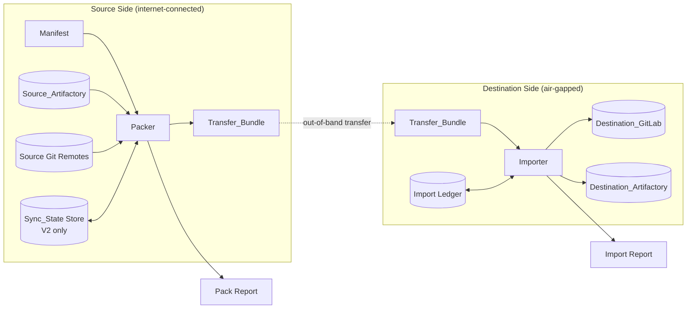
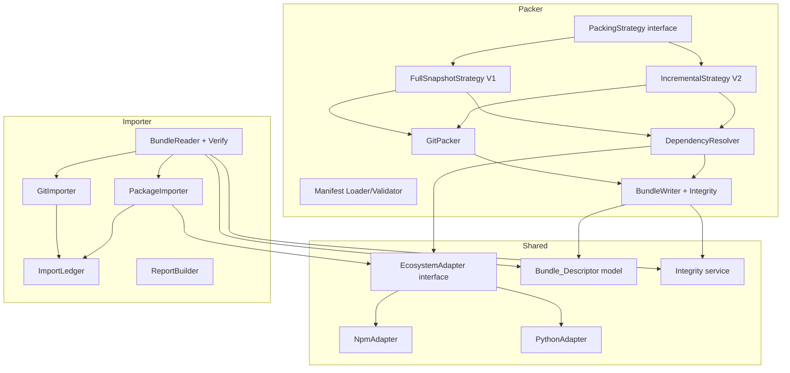
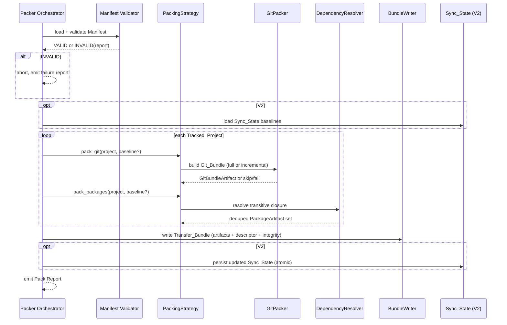
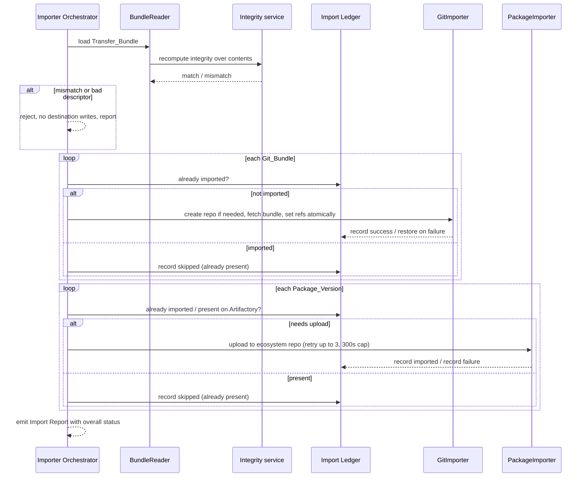

# Design Document

## Overview

The Airgap Package Sync Pipeline mirrors open source assets (git repositories and npm/Python packages) from an internet-connected source environment into an isolated air-gapped destination environment. It is split into two cooperating halves that never communicate directly:

- The **Packer** runs on the source side. It reads a validated Manifest, discovers and retrieves git history and package versions (plus their full transitive dependencies) from the Source_Artifactory and source git remotes, and produces a single self-contained, integrity-protected **Transfer_Bundle**.
- The **Importer** runs on the destination side. It loads a Transfer_Bundle that has been carried across the air gap out-of-band, verifies its integrity, then publishes git history to the Destination_GitLab and uploads package versions to the Destination_Artifactory, idempotently and resumably.

The pipeline ships in two delivery versions:

- **V1 (full-snapshot)** re-exports everything on every run. No change tracking, no persisted state. Self-contained and shippable on its own.
- **V2 (incremental)** layers change tracking (Sync_State) on top of V1 so each run packs only new git commits and only package versions not already packed.

The central design decision is that **only the packing strategy differs between V1 and V2**. Everything downstream of packing — the Transfer_Bundle format, the Bundle_Descriptor, integrity computation/verification, the Importer, reporting, and idempotency — is shared. V1 and V2 select a `PackingStrategy` implementation; the rest of the system is version-agnostic.

### Design Goals

1. **V1 ships alone.** V2 is purely additive: a second `PackingStrategy` plus a `SyncStateStore`. No shared component needs a V1-vs-V2 branch beyond strategy selection and the optional state read/write.
2. **Ecosystem-pluggable.** npm and Python differ only in version discovery, dependency-metadata parsing, and target repository type. These differences are isolated behind an `EcosystemAdapter` interface; the resolver, packer, and importer treat all packages uniformly.
3. **The bundle is the contract.** The Packer and Importer share nothing but the Transfer_Bundle format. The bundle is self-describing (via the Bundle_Descriptor) and self-verifying (via a single integrity value).
4. **Imports are safe to repeat.** Every import is idempotent and resumable through a destination-side per-item import ledger plus atomic ref updates.

### Recommended Implementation Stack

The design is language-agnostic, but the reference implementation targets **Node.js (current LTS, e.g. Node.js 20+) with TypeScript**. Git operations shell out to the native `git` CLI regardless of host language, and the JFrog/GitLab REST APIs are consumed over HTTP, so the pipeline tool itself has no language-imposed coupling to either package ecosystem.

**Important:** Implementing the pipeline in Node.js does **not** change the set of supported package ecosystems. Both the **npm** and **Python (PyPI)** ecosystems remain fully supported. The Python ecosystem adapter is still required to discover, download, and upload PyPI wheels and sdists and to parse Python distribution metadata (`Requires-Dist` in METADATA/PKG-INFO) — it simply does so from Node.js code rather than from Python tooling.

- Git operations: native `git` CLI (`git bundle create`, `git bundle verify`, `git fetch <bundle>`) invoked as a subprocess via Node's `child_process`.
- Artifactory access: JFrog REST API (AQL for version discovery, repository APIs for download/upload) via a Node HTTP client. Package uploads use the JFrog repository upload APIs directly (the Node equivalent of `twine`/`pip`-style publishing for the Python repo and `npm publish`-style publishing for the npm repo).
- GitLab access: GitLab REST API v4 (project creation, repository push via authenticated remote) via a Node HTTP client.
- Integrity: SHA-256 (via Node's `crypto` module) over a canonical serialization of bundle contents.
- Property-based testing: **fast-check** (the standard Node/TypeScript PBT library).

## Architecture

### High-Level Topology



The dashed edge is the air gap: a manual/physical transfer of one opaque file. Neither side opens a network connection to the other.

### Component Layering



### Key Architectural Decisions

**Decision 1: PackingStrategy as the single V1/V2 seam.**
The Packer orchestrator is identical for both versions. It selects a `PackingStrategy` at startup based on configuration. `FullSnapshotStrategy` ignores Sync_State and always packs everything; `IncrementalStrategy` reads Sync_State to compute a baseline and packs only deltas. Both produce the same intermediate artifacts (a list of `GitBundleArtifact` and a deduplicated set of `PackageArtifact`), which the shared `BundleWriter` serializes. This guarantees V1 and V2 produce byte-format-identical bundles that the same Importer consumes. *Rationale:* satisfies the "V1 shippable alone, V2 clean layering" requirement and keeps the Importer free of version logic.

**Decision 2: EcosystemAdapter isolates npm/Python differences.**
A single interface exposes `discover_versions`, `parse_dependencies`, `download`, `upload`, and `target_repository_kind`. npm parses `dependencies`/`optionalDependencies`/`peerDependencies` from `package.json`; Python parses `Requires-Dist` specifiers from distribution metadata (METADATA/PKG-INFO). The `DependencyResolver` and `PackageImporter` are written once against the interface. *Rationale:* satisfies "behavior that genuinely differs is called out explicitly" while keeping common behavior uniform.

**Decision 3: The Bundle_Descriptor is the source of truth for the Importer.**
The Importer never re-derives intent from the raw git/package data. It reads target commit references, package coordinates, and integrity scope from the descriptor. *Rationale:* makes the bundle self-contained and lets integrity verification cover exactly the bytes the Importer will act on.

**Decision 4: Integrity verification gates all destination writes.**
The Importer recomputes the integrity value over the full loaded contents before touching the destination. Any mismatch or descriptor defect aborts with zero side effects. *Rationale:* satisfies Requirement 2 trust boundary; the air gap means a corrupted bundle is the only failure mode that can silently poison the destination.

**Decision 5: Idempotency via a destination-side Import Ledger + atomic ref updates.**
The Importer maintains a per-item ledger (keyed by bundle id + item id) recording which Git_Bundles and Package_Versions are already successfully imported. Re-running consults the ledger and skips completed items. Git refs are only moved to their target after the full bundle is fetched into the destination repo, so an interruption never leaves a ref on partial history. *Rationale:* satisfies Requirement 6 resumability/idempotency independent of V1/V2.

### Control Flow — Packing



### Control Flow — Import



## Components and Interfaces

### Manifest Loader and Validator

Responsible for Requirement 1. Parses the Manifest file, runs structural and semantic validation, and yields either a `Manifest` with status `VALID` or a structured list of validation errors with status `INVALID`.

```text
interface ManifestValidator:
    load(path) -> ManifestLoadResult
        # ManifestLoadResult = { status: VALID|INVALID, manifest?, errors[] }
```

Validation rules (all failures are collected and reported, not just the first):
- Parse failure → INVALID with line/column (AC 1.10).
- 0 projects → INVALID "no Tracked_Projects" (AC 1.9, 1.3).
- Project count outside 1..1000 → INVALID (AC 1.3).
- Per project: unique id of 1..128 chars, non-empty git location, 0..1000 package coordinates (AC 1.2).
- Duplicate project id → INVALID, report the duplicate (AC 1.6).
- Missing required field → INVALID, report project id + field name (AC 1.8).
- Each package ecosystem ∈ {npm, Python} → else INVALID, report project id, coordinates, bad value (AC 1.4, 1.7).
- All checks pass → VALID (AC 1.5).

### PackingStrategy (V1/V2 seam)

```text
interface PackingStrategy:
    name() -> "V1" | "V2"
    git_baseline(project, syncState?) -> GitBaseline
        # FullSnapshot: always FULL
        # Incremental: FULL if no prior state / missing commit / unreadable state, else SINCE(lastCommit)
    package_filter(project, syncState?) -> PackageFilter
        # FullSnapshot: include all
        # Incremental: include only versions not in syncState.packedVersions
```

- `FullSnapshotStrategy` (V1): `git_baseline` always returns `FULL`; `package_filter` always includes. Never consults Sync_State.
- `IncrementalStrategy` (V2): consults Sync_State. Falls back to `FULL` per project when no prior state (AC 9.2), referenced commit missing (AC 9.5), or state unreadable (AC 9.6).

### GitPacker

Wraps the `git` CLI to produce a `GitBundleArtifact`.

```text
interface GitPacker:
    pack(project, baseline) -> GitBundleArtifact | SkipNoChanges | Failure
        # FULL        -> git bundle create <file> --all (full history of tracked refs)
        # SINCE(c)    -> git bundle create <file> <refs> --not <c> (commits not reachable from c)
```

- Records target commit reference per ref (AC 7.4); records source+target for incremental (AC 10.5).
- Incremental with no new commits → `SkipNoChanges` and "no git changes packed" (AC 10.4), unless a full pack is required (AC 10.6).
- Failure → exclude project, report, continue (AC 7.5 / 10.7).

### DependencyResolver

Ecosystem-agnostic transitive closure with cycle/dup protection. Drives `EcosystemAdapter` for discovery, metadata parsing, and retrieval.

```text
interface DependencyResolver:
    resolve(roots: PackageRef[], filter: PackageFilter) -> ResolveResult
        # ResolveResult = { included: PackageArtifact[], failures: RetrievalFailure[] }
```

Algorithm (worklist with a `visited` set keyed by `(ecosystem, coordinates, version)`):
1. Seed worklist with discovered root versions (V1: all; V2: all not already packed).
2. Pop a ref; if in `visited`, skip (AC 8.5 / 11.7). Mark visited.
3. Retrieve the version file; on failure record a retrieval-failure and continue (AC 8.6/8.7, 11.8/11.9).
4. Parse dependencies via the ecosystem adapter; for V2, drop deps already recorded in Sync_State (AC 11.4); enqueue the rest.
5. Continue until the worklist is empty.

The `visited` set guarantees termination on cyclic graphs and at-most-once inclusion.

### EcosystemAdapter (npm / Python)

```text
interface EcosystemAdapter:
    ecosystem() -> "npm" | "Python"
    discover_versions(coordinates) -> PackageRef[]          # via Artifactory
    parse_dependencies(versionFile) -> PackageRef[]         # npm: package.json deps; Python: Requires-Dist
    download(ref) -> bytes                                  # from Source_Artifactory
    upload(ref, bytes) -> UploadOutcome                     # to Destination_Artifactory
    target_repository_kind() -> "npm" | "pypi"              # which dest repo to use
```

- `NpmAdapter`: dependency union of `dependencies` + `optionalDependencies` + `peerDependencies`; downloads `.tgz`; uploads to the npm repo.
- `PythonAdapter`: parses `Requires-Dist` from METADATA/PKG-INFO, resolving markers/extras conservatively to concrete versions available on the Source_Artifactory; downloads wheels/sdists; uploads to the PyPI repo.

### BundleWriter / BundleReader and Integrity Service

```text
interface IntegrityService:
    compute(contents: BundleContents) -> string     # SHA-256 over canonical serialization
                                                     # scope: every Git_Bundle + every package file
                                                     # + descriptor metadata EXCLUDING integrity field
    verify(contents, recorded) -> bool

interface BundleWriter:
    write(artifacts, descriptorMeta) -> TransferBundle   # computes + embeds integrity (AC 2.1-2.3)

interface BundleReader:
    read(path) -> LoadedBundle | RejectReason            # verifies integrity before exposing contents (AC 2.4-2.6)
```

### GitImporter

```text
interface GitImporter:
    import_bundle(gitArtifact, descriptor, ledger) -> ItemOutcome
```

- Create destination repo if absent (AC 3.2); on creation failure skip + report + continue (AC 3.6).
- `git fetch <bundle>` into the repo, retaining existing refs/commits (AC 3.3).
- Set refs to target commit references only after full fetch succeeds (AC 3.4, 6.3, 6.5).
- On apply failure restore pre-application refs, report, continue (AC 3.5).
- Consult ledger first; skip already-imported items (AC 6.2, 6.4).

### PackageImporter

```text
interface PackageImporter:
    import_package(pkgArtifact, ledger) -> ItemOutcome
```

- Skip if same coordinates+version+ecosystem already present on Destination_Artifactory or in ledger; record "already present" (AC 4.3, 6.4).
- Upload to the ecosystem-appropriate repo (AC 4.2), 300s per-upload cap, up to 3 attempts (AC 4.1, 4.6).
- On success record imported (AC 4.4); if recording fails, halt package processing, report, retain prior records (AC 4.5).
- On upload failure/timeout after retries: report, leave prior uploads unchanged, continue (AC 4.6).

### ReportBuilder

Builds Pack and Import reports (Requirement 5) including Sync_Run id, delivery version, per-project packed refs/versions, skipped/already-present items, failures (carried into every report of the run — AC 5.4), and exactly one overall status (AC 5.5). Report generation failure marks the run failed (AC 5.6).

### SyncStateStore (V2 only)

```text
interface SyncStateStore:
    load() -> SyncState                 # per-project baselines (AC 9.3)
    persist(state) atomically           # either full new state or prior state readable (AC 9.1, 9.4)
```

## Data Models

```text
Manifest
    projects: TrackedProject[1..1000]
    status: VALID | INVALID

TrackedProject
    id: string (1..128, unique)
    gitLocation: string (non-empty)
    packages: PackageCoordinate[0..1000]

PackageCoordinate
    coordinates: string
    ecosystem: "npm" | "Python"

PackageRef            # an identified, retrievable version
    coordinates: string
    version: string
    ecosystem: "npm" | "Python"

PackageArtifact
    ref: PackageRef
    fileBytes: bytes

GitBundleArtifact
    projectId: string
    bundleFile: bytes
    sourceCommit: string?     # V2 incremental only
    targetCommits: map<ref, commitSha>

TransferBundle
    gitBundles: GitBundleArtifact[]
    packages: PackageArtifact[]
    descriptor: BundleDescriptor

BundleDescriptor
    bundleId: string (unique per Packer)
    deliveryVersion: "V1" | "V2"
    syncRunId: string
    projectCheckpoints: ProjectCheckpoint[]
    integrityValue: string            # excluded from its own computation
    integrityAlgorithm: "SHA-256"

ProjectCheckpoint
    projectId: string
    gitSourceCommit: string?          # V2
    gitTargetCommits: map<ref, sha>
    packedVersions: PackageRef[]
    retrievalFailures: RetrievalFailure[]

RetrievalFailure
    ref: PackageRef
    reason: string

SyncState                              # V2 only
    projects: map<projectId, ProjectBaseline>

ProjectBaseline
    lastPackedCommit: string
    packedVersions: set<PackageRef>

ImportLedger                           # destination side
    bundleId: string
    items: map<itemId, IMPORTED | PRESENT | FAILED>

SyncReport
    syncRunId: string
    deliveryVersion: "V1" | "V2"
    perProject: ProjectReport[]
    overallStatus: "succeeded fully" | "succeeded with skipped or failed items" | "failed"
    failures: ItemFailure[]
```

## Correctness Properties

*A property is a characteristic or behavior that should hold true across all valid executions of a system — essentially, a formal statement about what the system should do. Properties serve as the bridge between human-readable specifications and machine-verifiable correctness guarantees.*

The properties below were derived from the acceptance-criteria prework and consolidated to remove redundancy. They cover the pure-logic core of the pipeline: manifest validation, bundle serialization and integrity, transitive dependency resolution, V1/V2 git reconstruction, idempotent/atomic imports, reporting, and Sync_State persistence. Integration points with the Source/Destination Artifactory and GitLab are covered by integration tests (see Testing Strategy), not by these properties.

### Property 1: Manifest validity equals constraint satisfaction

*For any* generated Manifest, validation SHALL return status VALID if and only if every structural constraint holds: the project count is between 1 and 1000, every project id is unique and 1 to 128 characters, every git location is non-empty, every project has 0 to 1000 package coordinates, and every package ecosystem is npm or Python.

**Validates: Requirements 1.2, 1.3, 1.4, 1.5, 1.7, 1.9**

### Property 2: Manifest defects are reported precisely

*For any* Manifest containing a duplicate project id or a missing required field, validation SHALL return INVALID and the reported errors SHALL include, respectively, the duplicated identifier, or the affected project identifier together with the name of the missing field.

**Validates: Requirements 1.6, 1.8**

### Property 3: Transfer_Bundle round-trip preserves contents and checkpoints

*For any* set of Git_Bundle artifacts and Package_Version artifacts, writing them to a Transfer_Bundle and reading the bundle back SHALL yield exactly the same git bundles, the same package files, and a Bundle_Descriptor that records every packed target commit reference and every packed Package_Version's coordinates, version, and ecosystem.

**Validates: Requirements 2.1, 2.2, 7.4, 8.4, 10.5, 11.6**

### Property 4: Bundle identifiers are unique per Packer

*For any* sequence of packing runs performed by a single Packer, the bundle identifiers recorded in the produced Bundle_Descriptors SHALL be pairwise distinct.

**Validates: Requirements 2.2**

### Property 5: Integrity verification detects tampering and gates all destination writes

*For any* validly written Transfer_Bundle, integrity verification SHALL succeed on the unmodified bundle; and for any single-byte mutation of any included git bundle, package file, or descriptor field (other than the integrity value field), or for any absent, unparseable, or integrity-value-missing descriptor, verification SHALL fail, the Importer SHALL reject the bundle, and the destination SHALL receive no writes to the Destination_GitLab or Destination_Artifactory.

**Validates: Requirements 2.3, 2.4, 2.5, 2.6**

### Property 6: Transitive dependency resolution terminates and deduplicates

*For any* dependency graph (including graphs containing cycles and diamond dependencies), resolution from any set of roots SHALL terminate, and the resulting included set SHALL equal the set of versions reachable from the roots that satisfy the active include-filter, with each version present at most once.

**Validates: Requirements 8.3, 8.5, 11.3, 11.7**

### Property 7: Incremental package filter excludes already-packed versions

*For any* dependency graph and any Sync_State recording a set of already-packed versions, V2 resolution SHALL include exactly those reachable versions that are not recorded as already packed (and were retrievable), and SHALL exclude every version recorded as already packed.

**Validates: Requirements 11.1, 11.2, 11.4, 11.5**

### Property 8: Retrieval failures are excluded, recorded, and non-blocking

*For any* dependency graph in which an arbitrary subset of versions cannot be retrieved from the Source_Artifactory, every unretrievable direct or transitive version SHALL be absent from the Transfer_Bundle and recorded in the Bundle_Descriptor with a retrieval-failure indication (coordinates, version, ecosystem), and every other retrievable version in the closure SHALL still be included.

**Validates: Requirements 8.6, 8.7, 11.8, 11.9**

### Property 9: Git bundle production failure excludes only the affected project

*For any* set of Tracked_Projects in which producing the Git_Bundle fails for an arbitrary subset, the Transfer_Bundle SHALL exclude exactly the failed projects' git bundles, the report SHALL identify each failed project, and every other project's Git_Bundle SHALL still be produced.

**Validates: Requirements 7.5, 10.7**

### Property 10: V1 full-history bundles reconstruct every ref from empty

*For any* set of Tracked_Projects, V1 packing SHALL produce one Git_Bundle per project, and applying each Git_Bundle to an empty destination repository SHALL reconstruct every tracked ref at exactly the target commit reference recorded in the Bundle_Descriptor.

**Validates: Requirements 7.1, 7.2, 7.3, 3.1, 3.2**

### Property 11: V2 incremental packing reconstructs target refs and selects the correct baseline

*For any* repository with a prior import and any sequence of additional commits, V2 packing SHALL select a FULL baseline when no prior Sync_State exists or the recorded commit is missing or the state is unreadable, and otherwise SHALL produce a Git_Bundle containing exactly the commits reachable from the tracked refs but not from the last packed commit; applying that bundle on top of the already-imported history SHALL reconstruct each tracked ref at its recorded target commit, and when no new commits exist and no full pack is required no bundle SHALL be produced.

**Validates: Requirements 10.1, 10.2, 10.3, 10.4, 10.6, 9.2, 9.5, 9.6**

### Property 12: Importing retains previously imported history

*For any* destination repository already containing imported commits and refs, applying a further Git_Bundle SHALL retain all previously imported commits and refs and add the new commits and refs from the bundle.

**Validates: Requirements 3.3**

### Property 13: Import is idempotent and resumable

*For any* verified Transfer_Bundle and any record of a (possibly empty, possibly complete) subset of items already successfully imported, running the import SHALL apply only the items not already recorded as imported, and the resulting destination state SHALL have each repository's refs equal to the recorded target commit references and each Package_Version present exactly once — identical whether the import is run once or repeated — with all-already-imported bundles skipping every item and recording it as already present.

**Validates: Requirements 6.1, 6.2, 6.4, 4.3, 4.4**

### Property 14: Ref updates are atomic with respect to bundle application

*For any* Git_Bundle application that is interrupted or fails before all commits and refs have been applied, the destination repository refs SHALL remain at their pre-application state, and refs SHALL be moved to the recorded target commit references only after the full bundle has been applied; on failure the remaining Git_Bundles SHALL continue to be processed.

**Validates: Requirements 3.5, 6.3, 6.5**

### Property 15: Packages route to the ecosystem-matching repository

*For any* set of Package_Versions, each Package_Version SHALL be uploaded to the Destination_Artifactory repository whose kind matches that Package_Version's Package_Ecosystem (npm versions to the npm repository, Python versions to the PyPI repository).

**Validates: Requirements 4.2**

### Property 16: Sync_State persistence is atomic

*For any* Sync_State persistence attempt that fails at an arbitrary point, the subsequently readable Sync_State SHALL be either the complete updated state or the complete prior state, never a partial mixture, and on packing or persistence failure the prior baseline SHALL be retained unchanged for every Tracked_Project.

**Validates: Requirements 9.1, 9.4**

### Property 17: Reports completely list packed and imported items

*For any* completed packing operation, the Pack Report SHALL include the Sync_Run identifier and delivery version and list, per Tracked_Project, every packed target commit reference and every packed Package_Version with its ecosystem (including, under V2, explicit "no git changes" and "no Package_Versions" indications for empty projects); and *for any* completed import operation, the Import Report SHALL list every updated repository, every uploaded Package_Version with its ecosystem, and every item skipped as already present.

**Validates: Requirements 5.1, 5.2, 5.3**

### Property 18: Failures propagate into every report of the run

*For any* set of items that failed during a Sync_Run, every report produced during that run SHALL include each failed item identifier together with a failure reason, even when the current operation otherwise succeeded.

**Validates: Requirements 5.4**

### Property 19: Overall status is a single correct classification

*For any* combination of completion outcome and per-item skip/fail results, the report SHALL assign exactly one overall status: "succeeded fully" when no item was skipped or failed, "succeeded with skipped or failed items" when at least one item was skipped or failed while the operation otherwise completed, and "failed" when the operation could not complete.

**Validates: Requirements 5.5, 3.7**

## Error Handling

The pipeline distinguishes three error scopes, each with a defined containment boundary.

### Validation errors (fail fast, no side effects)

- Manifest parse/structure failures abort the run before any packing and produce an INVALID status with a complete, deduplicated error list (line/column for parse failures; project id + field for structural failures). No Transfer_Bundle is produced.
- Integrity/descriptor failures on the Importer abort before any destination write (Property 5). The destination is provably untouched.

### Per-item errors (isolate and continue)

The Packer and Importer process projects, git bundles, and package versions as independent items. A failure in one item is recorded and the next item is attempted:

- Git bundle production failure → exclude project, record in report, continue (Property 9).
- Package retrieval failure (direct or transitive) → exclude version, record retrieval-failure indication in descriptor, continue (Property 8).
- Git apply failure → roll back that repo's refs to pre-application state, record, continue (Property 14).
- Repo creation failure → skip that bundle, record, continue (Requirement 3.6 — covered by edge-case unit test).
- Package upload failure/timeout after 3 attempts → record, leave prior uploads unchanged, continue (Requirement 4.6 — covered by integration test).

### Halting errors (stop a phase, preserve recorded progress)

- Ledger-write failure after a successful package upload halts package processing immediately, reports the affected package, and retains all already-recorded items (Requirement 4.5 — edge-case unit test). This prevents the ledger from diverging from actual destination state.
- Sync_State persistence failure marks the Sync_Run failed and retains the prior baseline (Property 16).
- Report-generation failure marks the Sync_Run failed and surfaces the report error (Requirement 5.6 — edge-case unit test).

### Retry and timeout policy

Package uploads retry up to 3 attempts with a 300-second per-attempt cap (Requirements 4.1, 4.6). Retries and timeouts are timing/integration concerns validated by integration tests rather than property tests, since their behavior does not vary meaningfully with input.

## Testing Strategy

The pipeline mixes pure transformation logic (highly suited to property-based testing) with external-service integration (suited to example-based integration tests). The strategy uses both.

### Property-based tests

- Library: **fast-check** (Node/TypeScript). Property tests MUST NOT reimplement a PBT engine.
- Each of the 19 correctness properties above is implemented as a **single** property-based test.
- Minimum **100 iterations** per property test (fast-check `numRuns` set to at least 100).
- Each test is tagged with a comment referencing its design property in the format:
  `// Feature: airgap-package-sync-pipeline, Property {number}: {property text}`
- fast-check arbitraries required:
  - **Manifests**: random project counts (including 0, 1, 1000, 1001), ids of varying length (including 0, 1, 128, 129), git locations (including empty), coordinate lists (including 0, 1000, 1001), and ecosystems drawn from {npm, Python, arbitrary strings}; with optional injection of duplicate ids and dropped fields.
  - **Dependency graphs**: random DAGs and cyclic graphs with diamond dependencies across both ecosystems, with an injectable "unretrievable" subset and an injectable "already-packed" subset.
  - **Git repositories**: small synthetic repos built via the real `git` CLI (driven through `child_process`) with random commit/branch structure, used for V1/V2 reconstruction, retention, and atomic-ref properties (the destination is a real local bare repo; GitLab itself is mocked at the remote boundary).
  - **Bundle artifacts**: random git-bundle and package-file byte blobs plus descriptors, for round-trip, uniqueness, and integrity/tamper properties (the tamper arbitrary mutates a random byte of a randomly chosen content region).
  - **Import outcomes / status inputs**: random combinations of completed/failed operations and skipped/failed item sets, for reporting and status-classification properties.

### Unit and edge-case tests (example-based)

- Manifest parse failure line/column reporting (Requirement 1.10).
- Repo creation failure isolation (Requirement 3.6).
- Ledger-write failure halting package processing (Requirement 4.5).
- Report-generation failure marking the run failed (Requirement 5.6).

### Integration tests (1–3 examples each, NOT property-based)

These exercise external service wiring whose behavior does not vary meaningfully with input:

- **Source_Artifactory** (JFrog): npm version discovery via AQL, `.tgz` download; Python version discovery, wheel/sdist download. One example per ecosystem against a mocked or ephemeral Artifactory.
- **Destination_Artifactory** (JFrog): npm upload to the npm repo, Python upload to the PyPI repo, skip-if-present detection, 300s timeout and 3-attempt retry behavior (Requirements 4.1, 4.6).
- **Destination_GitLab**: project creation when absent, authenticated push of a git bundle, ref application, and rollback on push failure.
- **End-to-end smoke**: a minimal Manifest packed (V1 and V2) and imported against mocked Artifactory/GitLab, asserting overall report status.

### Test layering summary

| Concern | Test type |
|---|---|
| Manifest validation, integrity, resolution, idempotency, reconstruction, reporting, status | Property-based (Properties 1–19) |
| Parse line/column, creation-failure, ledger-failure, report-failure | Example/edge unit |
| Artifactory + GitLab API behavior, retry/timeout | Integration (1–3 examples) |

Property tests verify general correctness across the input space; unit tests pin concrete edge behaviors; integration tests confirm the external boundaries are wired correctly. Mocks are used at the Artifactory and GitLab boundaries inside property tests so the pure logic can run 100+ iterations cheaply.
